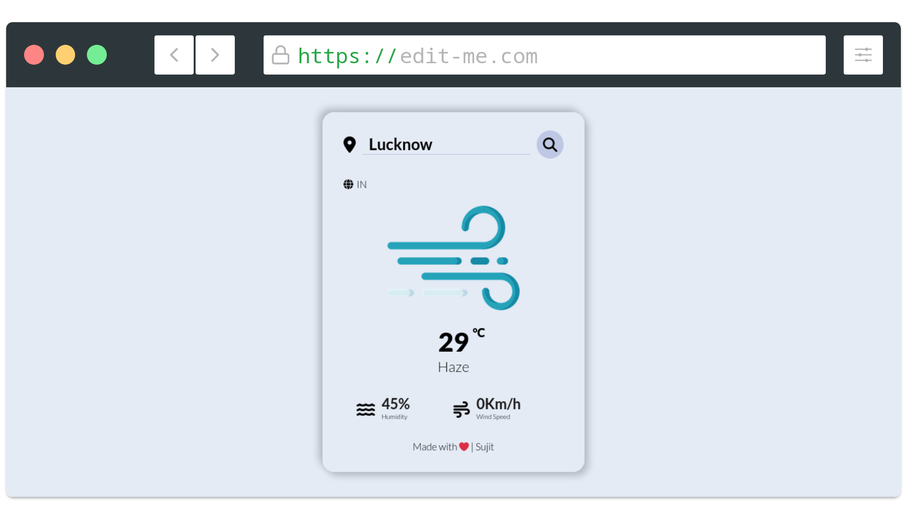

# Weather-app



Check the weather around you and all over the world at a glance.
Rely on the accurate weather forecast and adjust your schedule to the weather coming in. You won’t even have to look out the window as the app will make you feel like you are already outside!

Weather is sometimes difficult to predict. This accurate weather app allows to find out a detailed forecast wherever you are, for any time of the day by tapping on the icons:
- Current and “Feels like” temperature
- Wind speed and direction
- Pressure and precipitation information 
- Sunrise/sunset time

### Live-Preview


### Sample-Image


Run in Local
----------
1- Fork this repo


2- Clone this repo

```sh
git clone https://github.com/mnamesujit/weather-app/
```
3- Go to Working Directory
```sh
cd weather-app/
```
3- Write your Weather API_KEY in script.js file
```js
// const API_KEY = config.SECRET_API_KEY;
```

4- Open index.html file in web browser
